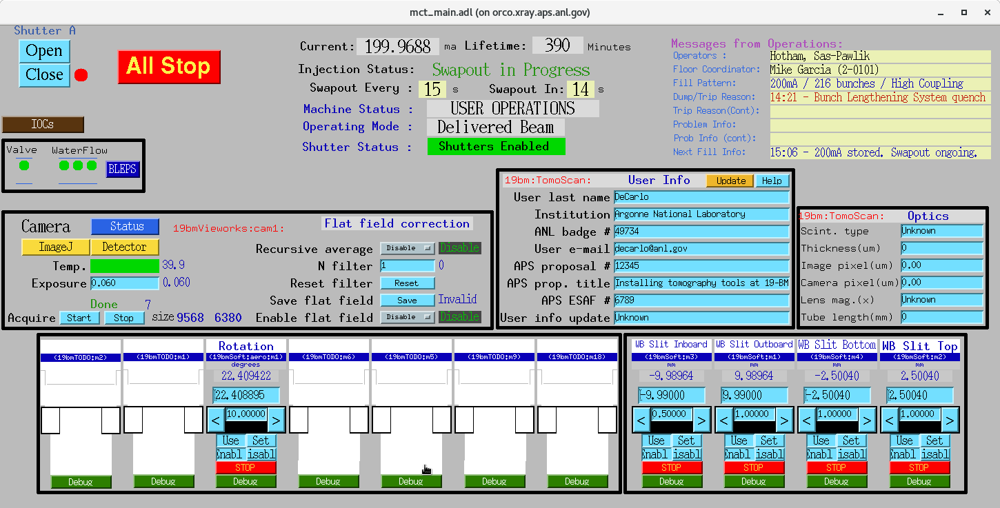
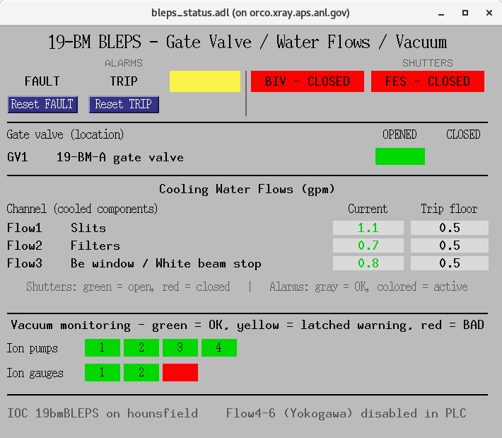
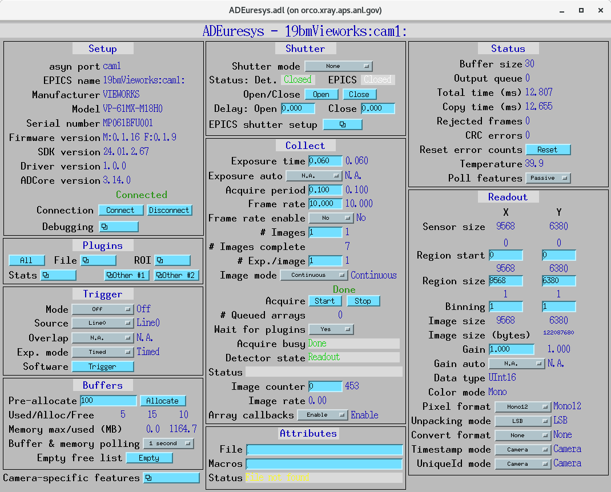
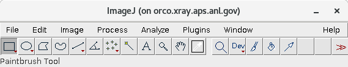
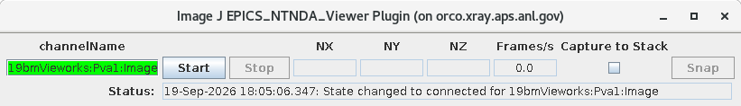
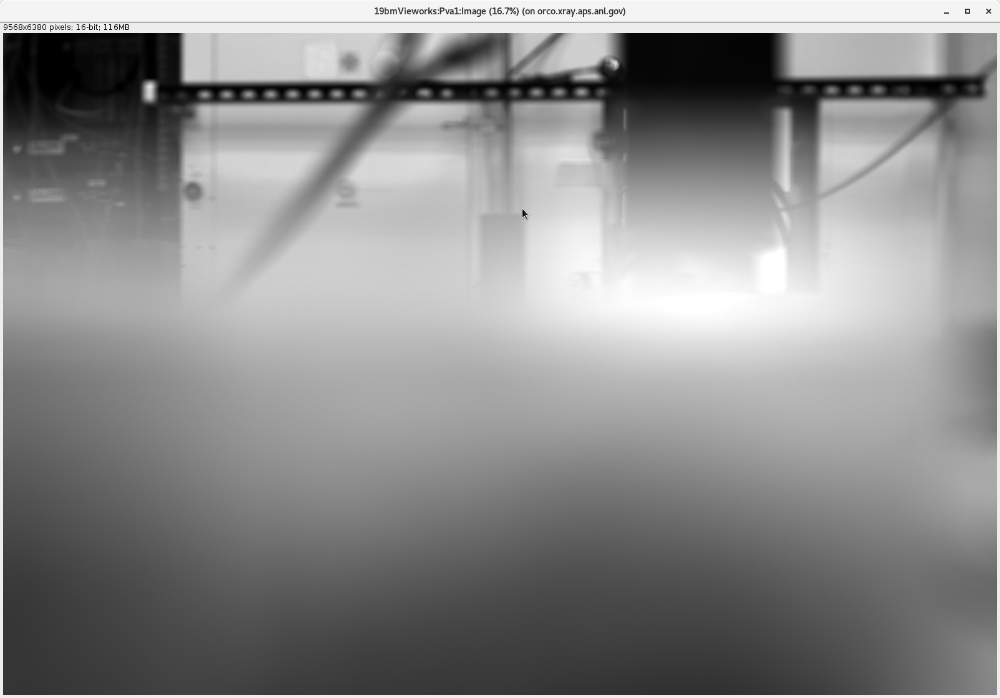

================
Beamline control
================

All beamline components and detectors are controlled using
`EPICS <https://epics-controls.org/>`_ and
`areaDetector <https://areadetector.github.io/master/index.html>`_.

Each device can be configured and controlled either through a graphical
user interface (GUI) or from Python using
`PyEpics <https://cars9.uchicago.edu/software/python/pyepics3/>`_.

To start the main 19-BM tomography control screen, run::

  [factuser@radon ~]$ start_tomo

.. note::

   At 2-BM a white field means the corresponding IOC is not running.
   **At 19-BM that is not always the case** — some panels are blank by
   design, because the hardware is not installed yet.

   Panels labelled ``19bmTODO:`` are placeholders: the hexapod being
   moved from 7-BM, and the X/Z centering pair that sits on top of the
   rotary stage. They are deliberately pointed at a prefix that does
   not exist, so that they show as disconnected rather than silently
   attaching to the wrong motor. They will connect once that hardware
   is racked and assigned a prefix.

   Panels naming a real prefix — ``19bmSoft:``, ``19bmVieworks:``,
   ``19bm:TomoScan:``, ``19bm:BLEPS:`` — *should* be populated. If one
   of those is blank, the IOC behind it is down. Use the ``IOCs``
   button to check, start or stop it.

``radon`` is the machine users run experiments from, and is where the
screen is normally opened. It is on the public network; the IOCs it
talks to are on the private one, reached through the sector gateway.

Note that MEDM runs each button's command on whatever machine MEDM
itself is running on. Opening the screen on ``radon`` therefore also
puts ImageJ and the camera image stream there, which is the intended
arrangement — but it does mean full frames cross the network from
``orco``. If that ever becomes a bottleneck, opening the screen on
``orco`` keeps the stream local to the machine holding the camera.

What the screen provides
========================

.. list-table::
   :header-rows: 1
   :widths: 26 74

   * - Area
     - Contents
   * - Top left
     - Front-end shutter Open / Close with status, **All Stop**, and
       buttons for the ``IOCs`` screen and ``BLEPS``, alongside the
       BLEPS valve and water-flow indicators.
   * - Top right
     - APS machine status — ring current, lifetime, injection and
       swapout, operating mode, shutter status, and the Operations
       message board.
   * - Camera
     - Detector status and control, exposure, acquisition, frame size,
       and flat-field correction. ``Detector`` opens the ADEuresys
       screen, ``ImageJ`` opens the image viewer.
   * - User Info / Optics
     - ``19bm:TomoScan:`` metadata written into the data files.
   * - Bottom
     - Motor panels: the rotation stage, the four white-beam slit
       blades, and placeholders for stages not yet installed.

.. warning::

   The white-beam slit panels are full motor controls, not readouts.
   They drive the four blades of the 19-BM-A white-beam slits directly,
   and the same motors also sit behind the ``Slit1H`` / ``Slit1V``
   size-and-centre records, so a blade moved here changes those too.

BLEPS
=====

The ``BLEPS`` button opens the equipment-protection status screen:

It shows the alarm summary and the front-end and beamline isolation
valve states, the 19-BM-A gate valve, the three cooling-water flows,
and the ion pumps and ion gauges. ``FAULT`` and ``TRIP`` can be
acknowledged here once the underlying condition has cleared.

See :doc:`item_002` for what BLEPS protects, the fault and trip
thresholds, and the full PV inventory.

.. note::

   Only the three ultrasonic flow channels are shown. The PLC also
   carries ``Flow4``..``Flow6``, a parallel Yokogawa set on the same
   three cooling services, but they are disabled and carry no
   interlock, so they are left off this screen.

Detector
========

The ``Detector`` button in the Camera panel opens the ADEuresys screen
for the Vieworks VP-61MX:

Viewing the live image
======================

The ``ImageJ`` button opens ImageJ:

Select **Plugins → EPICS_areaDetector → EPICS NTNDA Viewer**:

Set the channel name to ``19bmVieworks:Pva1:Image`` and press **Start**:

.. note::

   The channel name is remembered between sessions, in
   ``~/EPICS_NTNDA_Viewer.properties``, so it normally comes up already
   set. The plugin only rewrites that file when it is closed through
   its own **Exit** button — quitting ImageJ or closing the image
   window does not save it.

.. important::

   Use the **NTNDA** viewer, not ``EPICS AD Viewer``. The two look
   similar but the plain AD viewer uses Channel Access, and one full
   Vieworks frame is 9568 x 6380 x 2 = 122 MB — larger than the Channel
   Access array limit in use here. pvAccess has no such limit, which is
   why the channel to open is ``Pva1:Image`` rather than ``image1``.
